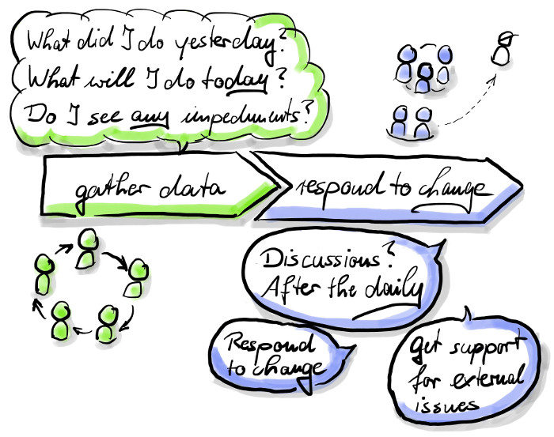

# Daily Scrum

## Why?
Check, if your plan is good enough to reach your sprint goal.

## What?
This is the time to plan the work for the next 24 hours.

## How?
* set a timebox of 15 minutes
* join at your Scrum board
* every team member answers the following questions:
  * What did I do yesterday for the team?
  * What will I do for the team today?
  * What are the impediments, I see?
* regarding to this data: how can the team reach it's sprint goal?
  * Can you support your colleagues?
  * Is there something, the team can change now?
  * Longer discussions: please, do it after the daily
  * impediment: ask your Scrum Master for support

